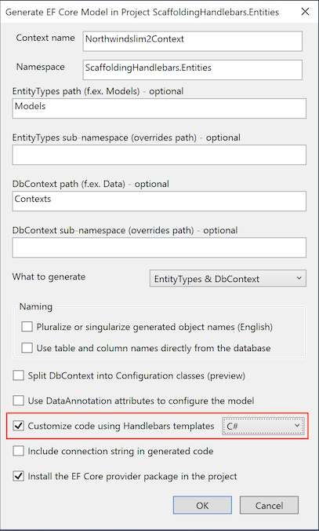
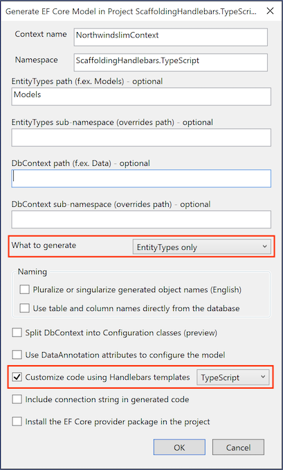

# EF Core Community Standup: Scaffolding with Handlebars Templates

Demos for July 2020 EF Core Community Standup

> **Prerequisites**:
> - [NorthwindSlim](https://github.com/TrackableEntities/northwind-slim) sample database.
>   - Create **NorthwindSlim** database.
>   - Run **NorthwindSlim.sql** script.
> - [EF Core Power Tools](https://github.com/ErikEJ/EFCorePowerTools/wiki).

> **References**:
> - [Entity Framework Core Tools Reference](https://docs.microsoft.com/en-us/ef/core/miscellaneous/cli/dotnet).
> - [Entity Framework Core Scaffolding with Handlebars](https://github.com/TrackableEntities/EntityFrameworkCore.Scaffolding.Handlebars).

> **Note**: When using Visual Studio for simple use cases, the **EF Core Power Tools** offers a _graphical user interface_ and the ability to directly target a _.NET Standard_ library.
> 
> For _advanced features_, such as Handlebars helpers and transformers, custom template data, nullable reference types and schema folders, it is necessary to use the **EF Core CLI**, which requires a "tooling" project that is a **.NET Core** library. You also need to add a `ScaffoldingDesignTimeServices` class to the tooling project.

### 1. EF Core Power Tools with Handlbars Templates (C#)

1. Create a **.NET Standard** library project with a **.Entities** suffix.
   - Because EF Core Power Tools is a Visual Studio extension, you can use it on a **.NET Standard** Library.
2. Add a **Data Connection** to the Server Explorer.
   - Server name: `(localdb)\MsSqlLocalDb`
   - Select `NorthwindSlim` database.
3. Right-click on **ScaffoldingHandlebars.Entities** project in the Solution Explorer, select EF Core Power Tools, Reverse Engineer.
   - Choose the NorthwindSlim data connection.
   - Select all tables.
   - Check: Customize code using Handlebars templates.
    
4. Modify the **Class.hbs** file to derive from `EntityBase`.
   - Add `EntityBase` class to the project.
5. Modify **Partials/Properties.hbs** to change `ICollection` to `List`.
   - Update **Constructor.hbs** to change `HashSet` to `List`
   - Rerun the EF Core Power Tools.

### 2. EF Core Power Tools with Handlbars Templates (TypeScript)

1. Create a **.NET Standard** library project with a **.TypeScript** suffix.
2. Right-click on **ScaffoldingHandlebars.Entities** project in the Solution Explorer, select EF Core Power Tools, Reverse Engineer.
   - Choose the NorthwindSlim data connection.
   - Select all tables.
   - What to generate: **Entity Types only**
   - Check: Customize code using Handlebars templates.
   - Select **TypeScript** as the language.
    

### 3. EF Core CLI with Handlebars Templates

1. Install EF Core Global Tool
    ```bash
    dotnet tool install --global dotnet-ef
    ```
   - You may need to update the tools to the latest available version.
    ```bash
    dotnet tool update --global dotnet-ef
    ```
2. Delete the CodeTemplates, Contexts and Models folders from the **.Entities** project.
3. Create a **.NET Standard** project with a **.Data** suffix.
   - This is where the `DbContext` class will be generated.
4. Create a **.NET Core** library project with a **.Tooling** suffix.
   - The tools need the .NET Core runtime to execute, so a .NET Standard project cannot be used by the tooling.
   - However, entities can be generated in a separate project by specifying the `--project` argument.
5. Reference the **ScaffoldingHandlebars.Entities** project.
6. Add EF Core Design, SQL Server and Scaffolding.Handlebars packages.
    ```bash
    dotnet add package Microsoft.EntityFrameworkCore.Design
    dotnet add package Microsoft.EntityFrameworkCore.SqlServer
    dotnet add package EntityFrameworkCore.Scaffolding.Handlebars
    ```
7. Add a `ScaffoldingDesignTimeServices` class that implements `IDesignTimeServices`.
    ```csharp
    public class ScaffoldingDesignTimeServices : IDesignTimeServices
    {
        public void ConfigureDesignTimeServices(IServiceCollection services)
        {
            services.AddHandlebarsScaffolding();
        }
    }
    ```
8. Run the `dotnet ef dbcontext scaffold` command.
   - Make sure you are in the **.Tooling** project directory.
   - Specify connection string, EF Core SQL Server provider, and target project.
    ```bash
    dotnet ef dbcontext scaffold "Data Source=(localdb)\MSSQLLocalDB; Initial Catalog=NorthwindSlim; Integrated Security=True" Microsoft.EntityFrameworkCore.SqlServer -o Models -c NorthwindSlimContext --context-dir Contexts --project ../ScaffoldingHandlebars.Entities --force
    ```
